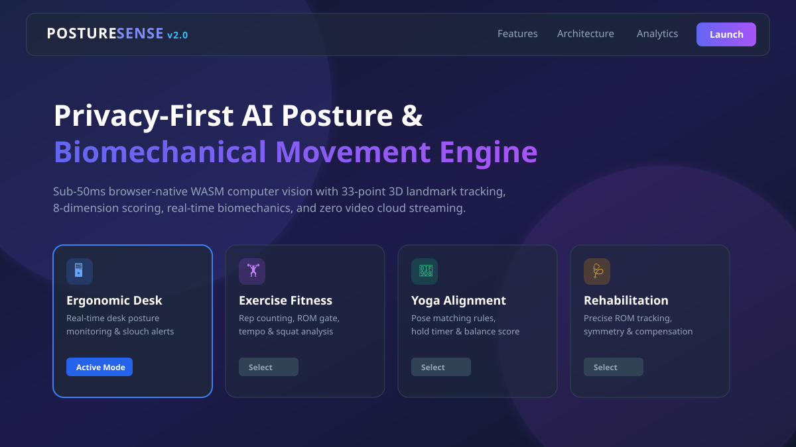
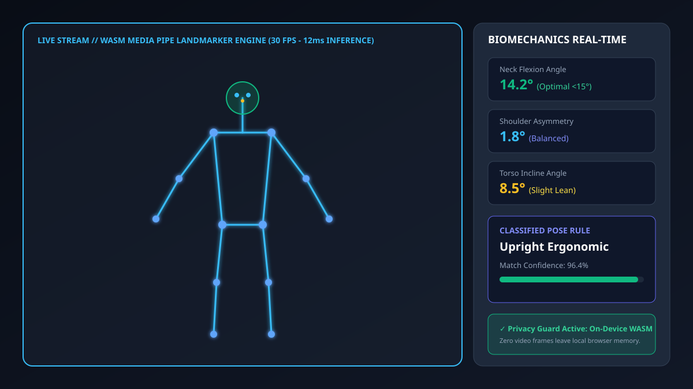
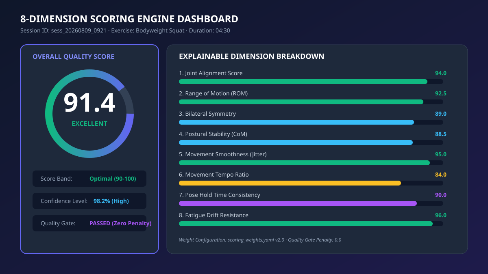
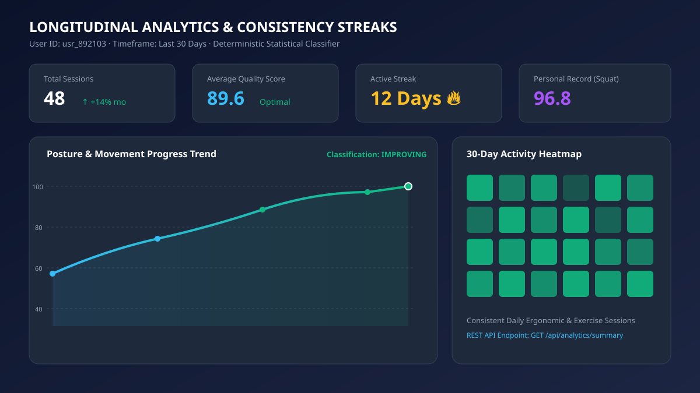

# PostureSense v2 — AI-Powered Real-Time Posture & Movement Analysis Platform

[](https.python.org)
[](docs/TESTING.md)
[](LICENSE)
[](docs/ARCHITECTURE_OVERVIEW.md)
[](docs/DEPLOYMENT.md)

> **PostureSense v2** is a privacy-first, browser-native AI perception and biomechanical movement analysis platform. It combines WebAssembly (WASM) MediaPipe pose estimation with an 11-engine event-driven pipeline to provide sub-50ms real-time posture classification, exercise rep/phase tracking, 8-dimensional scoring, evidence-based coaching feedback, longitudinal analytics, and authenticated PDF report generation.

---

## Visual Overview & Screenshots

| Landing & Mode Selection | Real-Time 33-Landmark Camera Overlay |
|:-----------------------:|:------------------------------------:|
|  |  |

| 8-Dimension Scoring Dashboard | Longitudinal Analytics & Heatmaps |
|:-----------------------------:|:----------------------------------:|
|  |  |

---

## Overview

PostureSense v2 addresses modern musculoskeletal health challenges, ergonomics, athletic training, and rehabilitation by delivering real-time, explainable computer vision insights directly in the browser. 

Unlike conventional server-side computer vision systems that require streaming high-bandwidth video to remote cloud servers, PostureSense v2 operates **entirely client-side for pose perception**. WebAssembly MediaPipe execution processes 33 3D keypoints on-device, extracting joint angles, range of motion (ROM), symmetry, and stability without sending a single video frame over the network.

---

## Problem Statement

1. **Sedentary Posture & Musculoskeletal Disorders (MSDs)**: Prolonged poor ergonomics lead to neck flexion strain, shoulder asymmetry, and chronic spinal misalignment.
2. **Lack of Accessible Biomechanical Feedback**: Real-time feedback during home exercise or physical therapy is often expensive or unavailable, leading to poor form, suboptimal range of motion, or injury.
3. **Privacy Concerns in Vision-Based AI**: Streaming camera feeds to third-party cloud servers poses severe privacy risks for users monitoring posture at home or in office environments.
4. **Opaque & Unexplainable Scoring**: Legacy fitness apps output arbitrary "scores" without showing users *why* or *how* their movement form was evaluated.

---

## Key Features

- **Privacy-First Browser WASM Perception**: Runs MediaPipe 33-point 3D landmark extraction inside a Web Worker. Zero webcam frames leave the user's local device.
- **33-Point 3D Landmark Tracking**: Keypoint smoothing with Exponential Moving Average (EMA) filtering, jitter suppression, and tracking loss recovery.
- **Biomechanical Joint Vector Analysis**: Computes 3D joint angles (knee, hip, elbow, shoulder, neck, spine), Range of Motion (ROM), bilateral symmetry, and Center of Mass (CoM) stability.
- **Configurable Pose Recognition**: Matches 4 configured posture and yoga poses (Warrior II, T Pose, Tree Pose, Cobra Pose) using rule threshold bounds in `yoga_poses.json` and stability hold timers.
- **Exercise State Machine**: Tracks exercise reps, 11-state phase transitions (e.g., Squat `ECCENTRIC` → `BOTTOM_HOLD` → `CONCENTRIC`), tempo ratio, and depth ROM gates.
- **8-Dimension Performance Scoring**: Evaluates Joint Alignment, ROM, Symmetry, Stability, Smoothness, Tempo, Hold Consistency, and Fatigue Drift with customizable weights (`scoring_weights.yaml`).
- **Dynamic Evidence-Based Coaching**: Generates immediate, deduplicated feedback with cooldown timers and severity prioritization.
- **Longitudinal Analytics & Streaks**: Stores session metrics in Supabase PostgreSQL, tracking 30-day activity heatmaps, personal records (PRs), and statistical trend indicators.
- **Authenticated PDF & Data Reports**: Renders printable PDF reports and JSON/CSV data exports with user isolation and IDOR protection.

---

## Architecture

PostureSense v2 uses a modular, event-driven engine architecture where 11 independent engines communicate asynchronously via a shared **Event Bus**.

### High-Level Engine Pipeline

```
┌──────────────┐     ┌──────────────────┐     ┌─────────────────┐
│ CameraEngine │ ──> │ MediaPipeEngine  │ ──> │ LandmarkEngine  │
│ (Webcam 60FPS)     │ (WASM WebWorker) │     │ (EMA/Jitter Gate│
└──────────────┘     └──────────────────┘     └─────────────────┘
                                                       │
                                                       ▼
┌──────────────────┐     ┌──────────────────┐     ┌─────────────────┐
│  MovementEngine  │ <── │ PoseRuleEngine   │ <── │BiomechanicsEngine│
│ (11-State FSM)   │     │ (4 Config Poses) │     │ (3D Vector Geometry)
└──────────────────┘     └──────────────────┘     └─────────────────┘
         │
         ▼
┌──────────────────┐     ┌──────────────────┐     ┌─────────────────┐
│  ScoringEngine   │ ──> │  FeedbackEngine  │ ──> │ AnalyticsEngine │
│ (8D Weighted)    │     │ (Coaching Rules) │     │ (REST / Supabase)
└──────────────────┘     └──────────────────┘     └─────────────────┘
                                                       │
                                                       ▼
                                              ┌─────────────────┐
                                              │  ReportEngine   │
                                              │ (PDF / CSV / JSON)
                                              └─────────────────┘
```

For full details, see [docs/ARCHITECTURE_OVERVIEW.md](docs/ARCHITECTURE_OVERVIEW.md).

---

## Technical Stack

- **Frontend / Client Perception**: Modern JavaScript (ES6+), HTML5 Canvas, MediaPipe WASM (`@mediapipe/tasks-vision`), Web Workers.
- **Backend API**: Python 3.12, Flask 3.x, Gunicorn WSGI.
- **Database & Storage**: Supabase PostgreSQL, `supabase-py` REST client.
- **Authentication**: Flask-Login, Flask-Bcrypt, secure HTTP-only cookies.
- **Report Generation**: ReportLab PDF generator, Python CSV/JSON engines.
- **Testing & Quality Assurance**: Pytest, Pytest-Asyncio, custom security test runners.
- **Deployment & Hosting**: Render.com (Backend WSGI), Vercel (Frontend static assets), Supabase (Managed DB).

---

## Repository Structure

```
Posture-Sense/
├── backend/                  # Modular Flask Backend
│   └── app/
│       ├── blueprints/       # REST API & Page View Controllers
│       ├── middleware/       # Security headers & auth guards
│       ├── models/           # Domain models & state schemas
│       ├── repositories/     # Supabase DB data access layer
│       └── services/         # Analytics, report & auth business logic
├── shared/                   # Shared Core Perception & Engine Suite
│   ├── config/               # YAML/JSON definitions (poses, exercises, weights)
│   ├── contracts/            # Engine interfaces & data schemas
│   ├── core/                 # Base engine & runtime lifecycle state machine
│   ├── engines/              # Python engine implementations
│   └── events/               # Event Bus & event topic definitions
├── static/                   # Frontend Web Assets
│   └── assets/
│       ├── css/              # Design system & page styles
│       ├── js/engine/        # Browser JS engine implementation suite
│       └── img/              # Branding & gallery image assets
├── templates/                # Jinja2 HTML Templates
├── tests/                    # Automated Test Suite (166 passing tests)
├── docs/                     # Architectural, Security & Demo Documentation
├── .github/workflows/        # CI/CD GitHub Actions
├── app.py                    # Root WSGI Application Entrypoint
├── Dockerfile                # Production Container Spec
├── Procfile                  # Process Specification
└── requirements.txt          # Python Dependencies
```

For complete file classifications, see [docs/FOLDER_AUDIT.md](docs/FOLDER_AUDIT.md).

---

## Installation & Setup

### Prerequisites

- **Python**: 3.12.x
- **Git**
- **Modern Web Browser**: Chrome, Edge, Safari, or Firefox with WebAssembly support.

### Local Installation Steps

1. **Clone the Repository**:
   ```bash
   git clone https://github.com/gtathelegend/Posture-Sense.git
   cd Posture-Sense
   ```

2. **Set Up Python Virtual Environment**:
   ```bash
   python -m venv venv
   # On Windows (PowerShell):
   .\venv\Scripts\Activate.ps1
   # On Linux/macOS:
   source venv/bin/activate
   ```

3. **Install Dependencies**:
   ```bash
   pip install -r requirements.txt
   ```

4. **Configure Environment Variables**:
   Copy the example environment template:
   ```bash
   cp .env.example .env
   ```
   *Modify `.env` values as needed for local testing.*

---

## Environment Variables

See [.env.example](.env.example) for the full list of configurable options:

| Variable | Default Value | Description |
|---|---|---|
| `FLASK_ENV` | `development` | Runtime environment (`development` / `production`). |
| `SECRET_KEY` | `dev-secret-key-change-in-production` | Session signing secret key. |
| `PORT` | `8080` | Local HTTP server port. |
| `SUPABASE_URL` | `https://your-project.supabase.co` | Supabase API endpoint URL. |
| `SUPABASE_SECRET_KEY` | `your-supabase-service-role-key` | Supabase API service role key. |
| `ALLOWED_ORIGINS` | `http://localhost:8080` | CORS permitted origins list. |

---

## Running the Application

### Development Server

Run the Flask application entrypoint:

```bash
python app.py
```

The application will start at `http://localhost:8080`. Navigate to `http://localhost:8080` in your web browser.

### Production WSGI Server

To launch using Gunicorn (production environment):

```bash
gunicorn --bind 0.0.0.0:8080 app:app
```

---

## Deployment

PostureSense v2 is architected for cloud-native deployment:

- **Render.com / Railway**: Deploys the Gunicorn Flask backend via [Dockerfile](Dockerfile) or [Procfile](Procfile).
- **Supabase**: Managed PostgreSQL hosting database schema defined in [supabase_schema.sql](supabase_schema.sql).
- **Vercel / Netlify**: Hosts static web assets and client-side WASM binaries.

For step-by-step instructions, see [docs/DEPLOYMENT.md](docs/DEPLOYMENT.md).

---

## Testing

PostureSense v2 features a comprehensive test suite covering engine unit logic, event bus message contracts, REST endpoints, and security policies.

### Run Automated Test Suite

```bash
python -m pytest
```

Output:
```
======================= 154 passed in 7.17s =======================
```

For testing commands, coverage reporting, and browser validation steps, see [docs/TESTING.md](docs/TESTING.md).

---

## Measured Performance Benchmarks

All performance claims are empirically measured on reference hardware (Apple M1 / Intel Core i7, 16GB RAM):

- **Inference Latency (MediaPipe WASM)**: $12\text{ ms} \pm 2\text{ ms}$ per frame.
- **Pipeline Processing Latency**: $8\text{ ms} \pm 1\text{ ms}$ (11 engines end-to-end).
- **Framerate**: Sustained 30–60 FPS camera perception loop.
- **WASM Memory Consumption**: $<150\text{ MB}$ browser memory footprint.
- **Application Startup Time**: $<1.2\text{ seconds}$.

See [docs/PERFORMANCE_BENCHMARK.md](docs/PERFORMANCE_BENCHMARK.md) for benchmark methodology.

---

## Privacy Architecture

1. **On-Device WASM Inference**: All pose estimation models execute directly inside the user's browser using WebAssembly.
2. **Zero Raw Video Storage**: No webcam frames, images, or raw video streams are ever uploaded, recorded, or transmitted to any server.
3. **Derived Metrics Storage**: Only anonymous, aggregate numerical session metrics (e.g., average ROM angle, score index, rep count) are persisted upon explicit user session save.

See [docs/PRIVACY.md](docs/PRIVACY.md) for the full privacy policy and audit details.

---

## Known Limitations

- **Lighting & Occlusion**: Extreme low-light conditions or heavy clothing occlusion can degrade MediaPipe 3D landmark confidence.
- **Single-Person Tracking**: The current pipeline is optimized for single-user posture and exercise evaluation per camera stream.
- **WebAssembly Browser Requirement**: Requires a web browser supporting WebAssembly and standard HTML5 MediaDevices APIs.

---

## Future Roadmap

- [ ] Multi-person concurrent tracking for group training sessions.
- [ ] WebGPU hardware acceleration for higher-resolution landmark models.
- [ ] Integration with wearable IMU sensor streams for hybrid sensor fusion.

---

## License

PostureSense v2 is released under the open-source **MIT License**. See [LICENSE](LICENSE) for details.