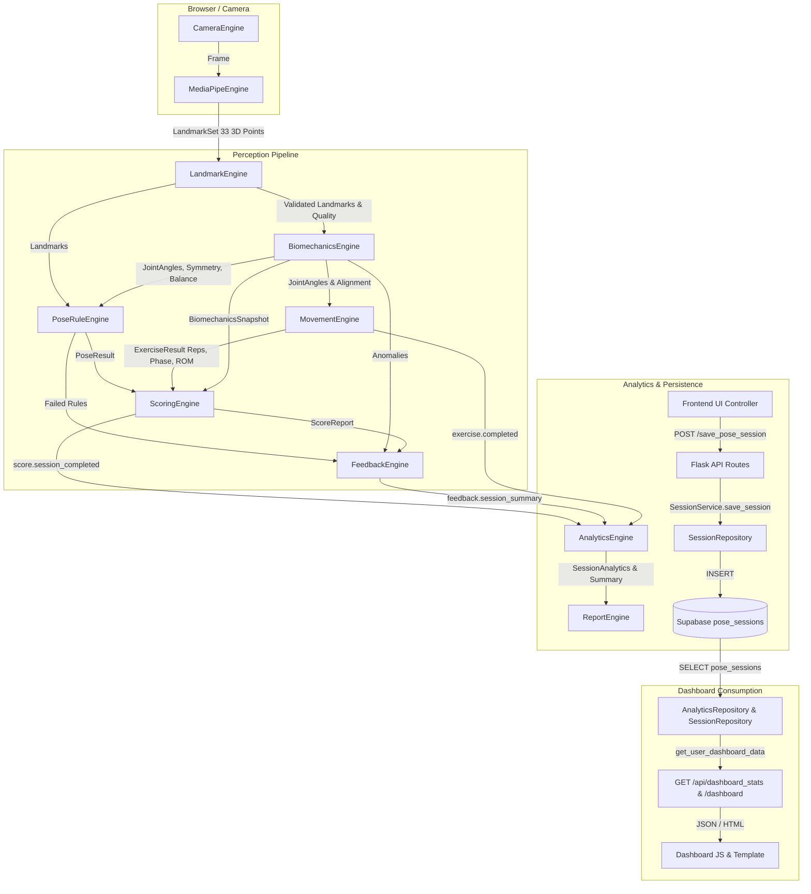

# PostureSense v2 — Analytics Data Audit & Pipeline Trace

## Overview

This audit establishes the exact data pipeline, inventory, engine behavior, and flow in PostureSense v2. It documents what data is produced by perception engines, what data is persisted, what data is exposed via REST APIs, and what data is consumed by the user dashboard.

---

# 1. Pipeline Data Flow Trace

### Engine-by-Engine Data Output Breakdown

1. **`CameraEngine`**
   - **Inputs:** MediaStream from user camera.
   - **Outputs:** `Frame` objects (width: 640, height: 480, fps: 30.0, frame_number, timestamp).
   - **Persistence:** Local browser canvas frame execution only. **Unpersisted**.

2. **`MediaPipeEngine`**
   - **Inputs:** Video frames or canvas context.
   - **Outputs:** `LandmarkSet` containing 33 normalized 3D pose landmarks (`x`, `y`, `z`, `visibility`, `presence`) and detection confidence.
   - **Persistence:** **Unpersisted**.

3. **`LandmarkEngine`**
   - **Inputs:** Raw `LandmarkSet` from MediaPipe.
   - **Outputs:** Validated and smoothed `LandmarkSet`, tracking quality metric (`0.0` - `100.0`), landmark visibility score.
   - **Persistence:** **Unpersisted**.

4. **`BiomechanicsEngine`**
   - **Inputs:** Validated `LandmarkSet`.
   - **Outputs:** `BiomechanicsSnapshot` containing:
     - `joint_angles`: List of `JointAngle` (joint_name, angle, expected_min, expected_max).
     - `symmetry_score`: Bilateral left/right angle variance score (`0.0` - `100.0`).
     - `balance_score`: Center of mass alignment over base of support (`0.0` - `100.0`).
     - `tracking_quality`: Overall landmark quality.
   - **Persistence:** **Unpersisted**.

5. **`PoseRuleEngine`**
   - **Inputs:** `LandmarkSet` and `BiomechanicsSnapshot`.
   - **Outputs:** `PoseResult` containing `pose_name`, `confidence`, `is_recognized`, matched rules, failed rules list.
   - **Persistence:** **Unpersisted**.

6. **`MovementEngine`**
   - **Inputs:** `LandmarkSet` and `JointAngle` streams over time.
   - **Outputs:** `ExerciseResult` containing:
     - `exercise_name` / `exercise_id`
     - `rep_count`: Integer completed reps.
     - `current_phase`: Phase string (`eccentric`, `concentric`, `isometric`, `hold`, `idle`).
     - `current_rep_duration` & `average_rep_duration`: Seconds.
     - `current_cadence`: Reps per minute.
     - `rom_percentage`: Range of motion (`0.0%` - `100.0%`).
     - `hold_time`: Accumulated hold time in seconds.
     - `movement_quality`: Form tracking score (`0.0` - `100.0`).
   - **Persistence:** **Unpersisted**.

7. **`ScoringEngine`**
   - **Inputs:** `PoseResult`, `ExerciseResult`, `BiomechanicsSnapshot`.
   - **Outputs:** `ScoreReport` containing:
     - `overall_score`: Composite posture accuracy (`0.0` - `100.0`).
     - `score_confidence`: Metric confidence rating (`0.0` - `1.0`).
     - `category`: Classification string (`Excellent`, `Good`, `Needs Improvement`).
     - `components`: Dictionary of sub-scores (`form`, `symmetry`, `balance`, `stability`, `rom`, `tracking_quality`).
     - `quality_gate_passed`: Boolean flag.
   - **Persistence:** **Unpersisted**.

8. **`FeedbackEngine`**
   - **Inputs:** `PoseResult`, `BiomechanicsSnapshot`, `ScoreReport`.
   - **Outputs:** `FeedbackResult` (category, type, severity, message, target_joint, correction_angle) and `FeedbackSessionSummary` (strengths, weak_areas, common_mistakes, improvement_areas).
   - **Persistence:** **Unpersisted**.

9. **`AnalyticsEngine`**
   - **Inputs:** Listens on EventBus for `score.session_completed`, `score.exercise_completed`, `feedback.session_summary`, `exercise.completed`.
   - **Outputs:** `SessionAnalytics`, `ExerciseAnalytics`, `TrendMetric`, `PersonalRecord`, `AnalyticsSummary`.
   - **Persistence:** **Browser local state / Python in-memory state only**. Flushed on restart unless backed by repository queries.

10. **`ReportEngine`**
    - **Inputs:** `AnalyticsSummary` and session dictionaries.
    - **Outputs:** Structured reports (`SessionReport`, `ExerciseReport`, `ProgressReport`, `ComprehensiveReport`) and export payloads (`JSON`, `CSV`, `PDF HTML`).
    - **Persistence:** On-the-fly generation. **Unpersisted**.

11. **`SessionRepository` & Database (`public.pose_sessions`)**
    - **Inputs:** `user_id`, `pose_label`, `duration`, `accuracy`.
    - **Outputs:** Saved DB record ID.
    - **Persistence:** **PERSISTED IN SUPABASE SQL DATABASE**.

---

# 2. Comprehensive Data Inventory

The following table audits every data attribute across the system. Verification was performed by direct inspection of engine files, contract definitions, database models, API blueprint handlers, and dashboard JavaScript.

| Data Field | Source Engine | Event Name | Contract Class & Field | Persisted in DB? | Exposed in API? | Rendered in UI? |
| :--- | :--- | :--- | :--- | :--- | :--- | :--- |
| **pose ID** | `PoseRuleEngine` | `pose.detected` | `PoseResult.pose_name` | ❌ No | ❌ No | ❌ No |
| **pose name** | `PoseRuleEngine` / `MovementEngine` | `pose.detected`, `exercise.completed` | `PoseResult.pose_name`, `ExerciseResult.exercise_name` | ✅ Yes (`pose_label`) | ✅ Yes (`pose_label`, `exercise_id`) | ✅ Yes (Dashboard table & distribution) |
| **confidence** | `MediaPipeEngine` / `PoseRuleEngine` | `landmarks.detected`, `pose.detected` | `LandmarkSet.confidence`, `PoseResult.confidence` | ❌ No | ❌ No | ❌ No |
| **hold time** | `MovementEngine` | `exercise.hold_updated` | `ExerciseResult.hold_time` | ✅ Yes (`hold_time`) | ✅ Yes (`totals.hold_time`, `/api/analytics/*`) | ❌ No |
| **matched rules** | `PoseRuleEngine` | `pose.rule_evaluated` | Engine internal state | ❌ No | ❌ No | ❌ No |
| **failed rules** | `PoseRuleEngine` / `FeedbackEngine` | `feedback.generated` | `FeedbackResult.rule_triggered` | ✅ Yes (`failed_rules`) | ✅ Yes (`failed_rules` in reports/recent) | ❌ No |
| **tracking state** | `LandmarkEngine` | `landmarks.validated` | `BiomechanicsSnapshot.tracking_quality` | ✅ Yes (`tracking_quality`) | ✅ Yes (`biomechanics.tracking_quality`) | ❌ No |
| **landmark quality** | `LandmarkEngine` | `landmarks.validated` | `LandmarkSet.confidence` | ❌ No | ❌ No | ❌ No |
| **joint angles** | `BiomechanicsEngine` | `biomechanics.calculated` | `BiomechanicsSnapshot.joint_angles` | ❌ No | ❌ No | ❌ No |
| **symmetry** | `BiomechanicsEngine` | `biomechanics.calculated` | `BiomechanicsSnapshot.symmetry_score` | ✅ Yes (`symmetry_score`) | ✅ Yes (`biomechanics.symmetry`) | ❌ No |
| **balance** | `BiomechanicsEngine` | `biomechanics.calculated` | `BiomechanicsSnapshot.balance_score` | ✅ Yes (`balance_score`) | ✅ Yes (`biomechanics.balance`) | ❌ No |
| **orientation** | `BiomechanicsEngine` | `biomechanics.calculated` | `BiomechanicsSnapshot` | ❌ No | ❌ No | ❌ No |
| **center of mass** | `BiomechanicsEngine` | `biomechanics.calculated` | Engine internal calculations | ❌ No | ❌ No | ❌ No |
| **ROM** | `MovementEngine` | `exercise.rep_completed` | `ExerciseResult.rom_percentage` | ✅ Yes (`rom_score`) | ✅ Yes (`biomechanics.rom`) | ❌ No |
| **stability** | `BiomechanicsEngine` / `ScoringEngine` | `score.evaluated` | `ScoreReport.components["stability"]` | ✅ Yes (`stability_score`) | ✅ Yes (`biomechanics.stability`) | ❌ No |
| **movement phase** | `MovementEngine` | `exercise.phase_changed` | `ExerciseResult.current_phase` | ❌ No | ❌ No | ❌ No |
| **repetitions** | `MovementEngine` | `exercise.rep_completed` | `ExerciseResult.rep_count` | ✅ Yes (`reps`) | ✅ Yes (`totals.reps`, `/api/analytics/*`) | ❌ No |
| **cadence** | `MovementEngine` | `exercise.rep_completed` | `ExerciseResult.current_cadence` | ❌ No | ❌ No | ❌ No |
| **score** | `ScoringEngine` | `score.evaluated` | `ScoreReport.overall_score` | ✅ Yes (`accuracy`) | ✅ Yes (`accuracy`, `overall_average_score`) | ✅ Yes (Dashboard stat card & table) |
| **feedback** | `FeedbackEngine` | `feedback.generated` | `FeedbackResult.message` | ❌ No | ❌ No | ❌ No |
| **session duration** | `CameraEngine` / Frontend | `score.session_completed` | `SessionAnalytics.duration` | ✅ Yes (`duration`) | ✅ Yes (`duration`, `total_duration`) | ✅ Yes (Dashboard stat card & table) |
| **timestamps** | Backend DB / Engine | System timestamp | `BaseContract.timestamp` | ✅ Yes (`timestamp`) | ✅ Yes (`timestamp`) | ✅ Yes (Dashboard table) |
| **session ID** | Backend DB / Analytics | `score.session_completed` | `SessionAnalytics.session_id` | ✅ Yes (`id` primary key) | ✅ Yes (`session_id`) | ❌ Hidden |
| **user ID** | Auth / Supabase | System session | `SessionAnalytics.user_id` | ✅ Yes (`user_id` FK) | ✅ Yes (`user_id`) | ❌ Hidden |

---

# 3. AnalyticsEngine Verification

Inspected files:
- `shared/engines/analytics_engine.py`
- `static/assets/js/engines/analytics_engine.js`
- `shared/contracts/analytics.py`

### Derived Metrics & Calculation Logic

1. **Averages:**
   - `overall_average_score`: Calculated as $\frac{\sum \text{session.accuracy}}{\text{total\_sessions}}$.
   - `average_rom`, `average_stability`, `average_symmetry`, `average_form`: Running averages calculated inside `_update_exercise_analytics()` when a live session report with component scores is provided.

2. **Trends:**
   - `overall_score`: Uses linear regression slope calculation ($\text{slope} = \frac{\text{cov}(x,y)}{\text{var}(x)}$) and percentage change ($\frac{\text{last} - \text{first}}{\text{first}} \times 100$) over a minimum of 3 observations.
   - Classifications: `IMPROVING` (slope > 0.2 or change > 2%), `DECLINING` (slope < -0.2 or change < -2%), `STABLE`, or `INSUFFICIENT_DATA` (< 3 observations).
   - **Source Fields:** Session `average_score` history.

3. **Improvements:**
   - `improvement_percentage`: Derived from comparing the latest session score to the oldest baseline session score or exercise average score.

4. **Personal Records:**
   - Evaluated dynamically in `_evaluate_personal_records()` for candidate metrics:
     - `Highest Score` (unit: points)
     - `Longest Hold / Duration` (unit: seconds)
     - `Most Reps` (unit: reps)
     - `Best ROM` (unit: %)
     - `Best Stability` (unit: %)
     - `Best Symmetry` (unit: %)
   - **Source Fields:** `ScoreReport` component scores and `SessionAnalytics` values.

5. **Streaks & Consistency:**
   - `streak_days`: Calendar day streak calculated by converting session timestamps into ISO dates, sorting unique dates, and checking consecutive day deltas ($d_i - d_{i-1} == 1$).
   - `score_consistency`: Standard deviation of session scores subtracted from 100 ($\max(0.0, 100.0 - \sigma_{\text{scores}})$).

6. **Exercise History & Pose History:**
   - Aggregated per `exercise_id` / `pose_label` into `total_sessions`, `total_repetitions`, `best_score`, `average_score`, `best_rom`, `average_rom`, `average_stability`, `average_symmetry`.

7. **Session Comparisons:**
   - Calculates deltas for the latest session vs:
     - `vs_previous`: Delta against preceding session score.
     - `vs_recent_avg`: Delta against mean of last 5 sessions.
     - `vs_personal_best`: Delta against all-time maximum score.
