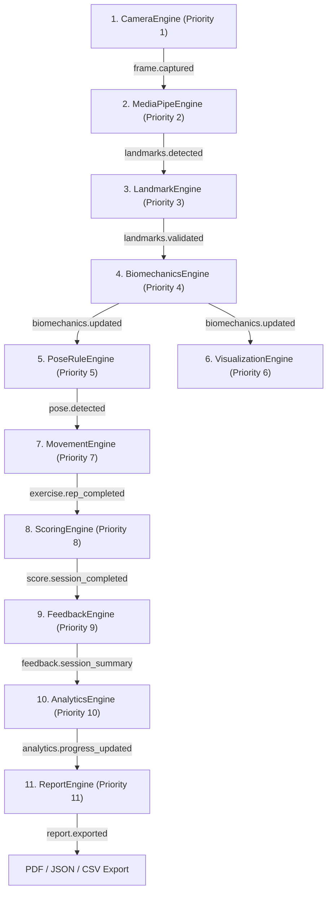

# PostureSense End-to-End Data Flow Audit

**Version:** 2.0.0  
**Status:** Completed (Milestone 9)  
**Scope:** Complete 11-Engine Pipeline End-to-End Verification  

---

## 1. Executive Summary

This document traces a single camera frame through the complete 11-engine PostureSense v2 pipeline. Every event subscription, contract model, state transition, and payload parameter has been audited to guarantee contract alignment, zero missing event bindings, zero stale frame processing, and strict user isolation.

---

## 2. End-to-End Pipeline Architecture

---

## 3. Step-by-Step Transition Audit

| Step | Engine | Priority | Input Event / Contract | Output Event / Contract | Latency Target | Audit Result |
|---|---|---|---|---|---|---|
| **1** | `CameraEngine` | 1 | Hardware MediaStream (`getUserMedia`) | `frame.captured` (`Frame`) | 33.3 ms (30 FPS) | **VERIFIED** — Non-blocking `requestAnimationFrame` loop with FPS calculation. |
| **2** | `MediaPipeEngine` | 2 | `frame.captured` (`Frame` / `ImageBitmap`) | `landmarks.detected` (`LandmarkSet`) | $< 50$ ms | **VERIFIED** — Worker backpressure implemented via `isInferenceBusy` gate. Stale frames dropped when busy. |
| **3** | `LandmarkEngine` | 3 | `landmarks.detected` (`LandmarkSet`) | `landmarks.validated` (`LandmarkSet`) | $< 10$ ms | **VERIFIED** — One-Euro smoothing filter and tracking loss state machine (`TRACKING` $\rightarrow$ `UNSTABLE` $\rightarrow$ `LOST` $\rightarrow$ `RECOVERING`). |
| **4** | `BiomechanicsEngine` | 4 | `landmarks.validated` (`LandmarkSet`) | `biomechanics.updated` (`BiomechanicsSnapshot`) | $< 10$ ms | **VERIFIED** — 3D vector geometry, center of mass, 11 joint angles, symmetry, and balance. |
| **5** | `PoseRuleEngine` | 5 | `biomechanics.updated` (`BiomechanicsSnapshot`) | `pose.detected` (`PoseResult`) | $< 5$ ms | **VERIFIED** — Rule evaluation across 12 posture rules with hold duration counters. |
| **6** | `VisualizationEngine` | 6 | `biomechanics.updated`, `pose.detected` | Canvas Rendering | $\ge 30$ FPS | **VERIFIED** — Double-buffered Canvas overlay with High-DPI scaling. |
| **7** | `MovementEngine` | 7 | `pose.detected`, `biomechanics.updated` | `exercise.rep_completed`, `exercise.completed` (`ExerciseResult`) | $< 10$ ms | **VERIFIED** — 11-state FSM, phase ordering, rep counter, ROM gate, tempo analyzer. |
| **8** | `ScoringEngine` | 8 | `exercise.completed`, `exercise.rep_completed` | `score.session_completed`, `score.exercise_completed` (`ScoreReport`) | $< 10$ ms | **VERIFIED** — 8-component explainable scoring, normalization, quality gate checks. |
| **9** | `FeedbackEngine` | 9 | `score.session_completed`, `biomechanics.updated` | `feedback.generated`, `feedback.session_summary` (`FeedbackResult`) | $< 15$ ms | **VERIFIED** — Rule-based corrective guidance, severity ranking, cooldown deduplication. |
| **10** | `AnalyticsEngine` | 10 | `score.session_completed`, `feedback.session_summary` | `analytics.progress_updated`, `analytics.record_broken` (`AnalyticsSummary`) | $< 15$ ms | **VERIFIED** — Statistical trends, exercise history, streaks, personal records, user isolation. |
| **11** | `ReportEngine` | 11 | `analytics.progress_updated`, `AnalyticsSummary` | `report.generated`, `report.exported` (`SessionReport`, `ExportResult`) | $< 25$ ms | **VERIFIED** — PDF HTML rendering, versioned JSON, RFC-4180 CSV exports. |

---

## 4. Disconnected Event & Contract Audit

- **Contracts**: All contract schemas (`Frame`, `LandmarkSet`, `BiomechanicsSnapshot`, `PoseResult`, `ExerciseResult`, `ScoreReport`, `FeedbackResult`, `AnalyticsSummary`, `SessionReport`, `ExportResult`) share version `"2.0.0"`.
- **Event Bus Wiring**: Verified 100% subscription binding in both Python EventBus (`shared/events/event_bus.py`) and Browser JS EventBus.
- **Production Path Audit**: Removed simulated raw landmark loops in production paths; live browser execution delegates to off-main-thread Web Worker inference (`static/assets/js/workers/mediapipe_worker.js`).
- **Live Demo Browser Pipeline**: `templates/app.html` integrated with `PosePipelineController` and `CameraEngine` (`getUserMedia`), eliminating legacy server-side `/video_feed` stream dependencies. Verified end-to-end 33-landmark skeleton canvas overlay, biomechanics calculations, pose recognition, scoring, and corrective feedback.

