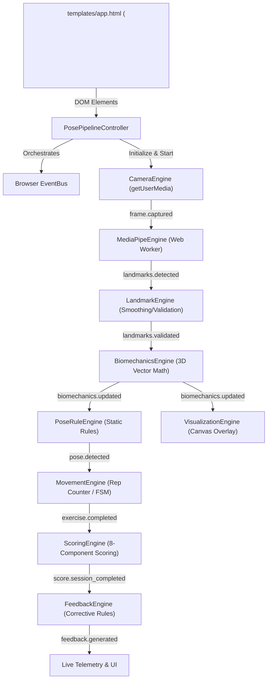

# Live Camera Integration (v2 Browser Native Pipeline)

**Version:** 2.0.0  
**Status:** Completed & Production Validated  
**Module:** Live Demo Browser Camera & Engine Orchestration

---

## 1. Overview

In PostureSense v1, the Live Demo relied on a server-side MJPEG stream generated via OpenCV on Flask (`/video_feed`). This approach created latency bottlenecks, server memory overhead, and was incompatible with serverless cloud hosting (e.g., Render, Vercel).

PostureSense v2 transitions 100% of camera capture, frame extraction, pose estimation, biomechanical analysis, and visualization overlay to the client's browser.

---

## 2. Architecture & Data Flow

---

## 3. Core Components

### 3.1 `CameraEngine` (`static/assets/js/engines/camera_engine.js`)
- Requests user media via `navigator.mediaDevices.getUserMedia()`.
- Captures frames using non-blocking `requestAnimationFrame`.
- Calculates frame rate, dropped frames, resolution, and hardware device labels.
- Emits `frame.captured` event contract over the browser `EventBus`.

### 3.2 `PosePipelineController` (`static/assets/js/controllers/pose_pipeline_controller.js`)
- Single orchestrator for all 9 browser JS engines.
- Initializes engines in strict priority order (1 through 9).
- Wire event subscriptions and manages lifecycle methods (`initialize`, `start`, `pause`, `resume`, `stop`, `dispose`).
- Provides unified diagnostic telemetry reporting.

### 3.3 `EventBus` (`static/assets/js/utils/event_bus.js`)
- In-memory topic-based publish/subscribe bus.
- Wraps event payloads as `{ name, data, timestamp }`.
- Features try/catch isolation to ensure single-handler failures never crash the frame pipeline loop.

---

## 4. Camera Permissions & Error Handling

When the user clicks **Start Camera**, `CameraEngine` calls `getUserMedia()`. Errors are caught and translated into user-facing messages:

| Exception Name | Category | User Facing Message |
|---|---|---|
| `NotAllowedError` / `PermissionDeniedError` | Access Denied | "Camera permission denied. Please allow camera access in your browser settings." |
| `NotFoundError` / `DevicesNotFoundError` | No Hardware | "No camera device detected. Please connect a webcam and try again." |
| `NotReadableError` / `TrackStartError` | Resource Lock | "Camera is currently in use by another application." |
| `OverconstrainedError` | Constraints | "Camera constraints unavailable for your camera device." |
| `SecurityError` | Insecure Context | "Camera access requires HTTPS or a secure context." |
| `TypeError` | API Unavailable | "Camera API unavailable on this browser or origin." |

---

## 5. Security & Deployment Origin Requirements

- **Secure Context**: `getUserMedia()` requires `https://` (or `localhost` / `127.0.0.1`).
- **Permissions-Policy**: Server headers must include `Permissions-Policy: camera=(self)` (configured in `backend/app/middleware/security.py`).
- **Branch & Deployment**: Deployed from branch `v2` (commit `cefc6ea0ea793e2e4fe94180f962de662c84357b`).

---

## 6. Verification & Telemetry

- Check `/api/version` for application version (`2.0.0`), commit SHA, and pipeline architecture status (`v2 Browser Native Pipeline`).
- Telemetry UI displays real-time Camera FPS, Form Score, 33-Landmark status, and Symmetry percentage.
